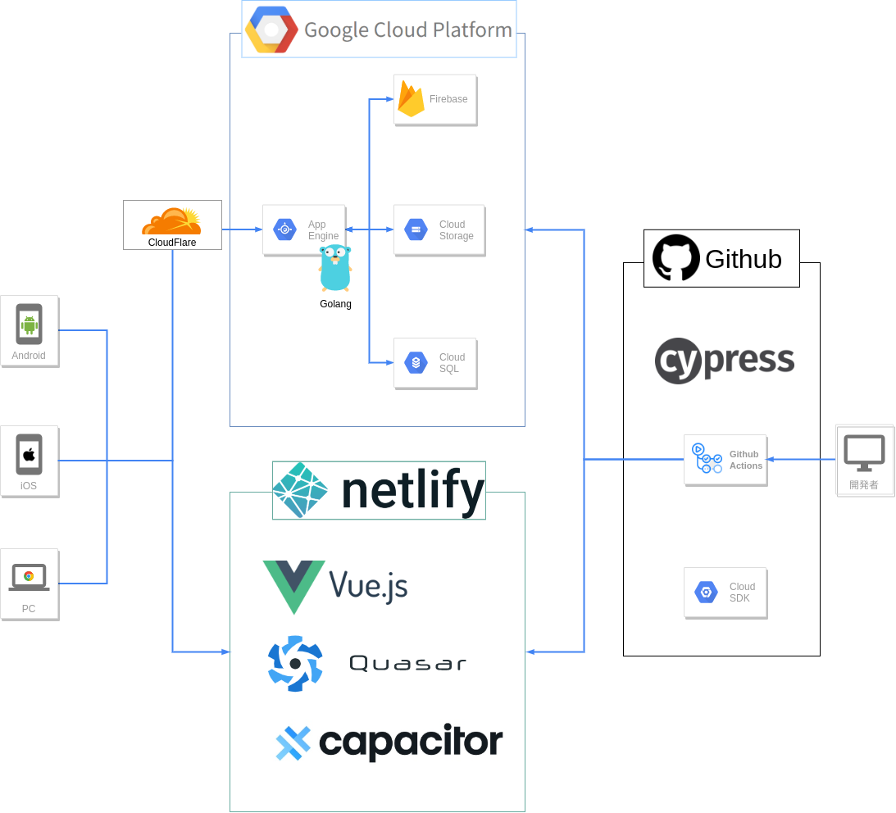

  

<h1 align="center">OGP Gallery</h1>

## バックエンド部分概要
このリポジトリには以下が含まれます
- APIに利用しているGolangのコード(GCPのSDK含む)
- DB用のSQLファイル
- Docker Compose用の設定ファイル
- テストコード(Golangのユニットテスト)
- CI/CDのコード

## APIについて
Golang標準のnet/httpパッケージと100%互換のルーターである[Chi](https://github.com/go-chi/chi)を利用して作成しています。  
- [API部分のコード](https://github.com/go-u/ogp-back/tree/master/server)  
- [自作のChiミドルウェア(CloudFlare経由のIPを取得, net/http準拠)](https://github.com/go-u/ogp-back/blob/master/server/middleware_custom/get_cloudflare_ip.go)

## システム構成について
Google系のクラウドサービスを利用しています(GCP / GAE / GCS / CloudSql / Firebase等)
- Api(Golang)はApp Engineスダンダードを利用
- ユーザのプロフィール画像の保存にはCloud Storage を利用
- データベースはCloud SQLのMysqlを利用
- ユーザ登録やJWT認証にFirebase SDKを利用
- プッシュ通信の送信もFirebase SDKを利用  
  (一斉送信は対応済み/ユーザ個別の送信機能は開発中)

## DBについて
DBはMySQLを使用しています。  
ORMは[SQLBoiler](https://github.com/volatiletech/sqlboiler)を利用しています。  
高速化やDB負荷を意識してORMを使わずに直接クエリを書くこともできます。  
DBのマイグレーションにはsql-migrateを利用しています。 

別途PythonからPostgreSQL/MongoDB/Redisを利用した経験が有ります。  

## セキュリティについて
- APIへのダイレクトアクセスはファイアーウォールで制限しています  
- APIはTorネットワークからのアクセスを禁止していたずらを防いでいます

## テストについて
先日リリースしたばかりのためテストは作成中です。  
参考程度ですが以下のようにテーブルテストを意識しています。
- [ユーザ名の検証用関数のテーブルテスト](https://github.com/go-u/ogp-back/blob/master/server/api/v1/users/validate_test.go)  

## CI/CDについて
プロトタイプ段階の現在は以下のようなGithub Actionsを用いています。
- [プッシュ時にユニットテスト](https://github.com/go-u/ogp-back/blob/master/.github/workflows/test.yml)
- [プルリク時に検証用のGAE環境に自動デプロイ](https://github.com/go-u/ogp-back/blob/master/.github/workflows/deploy_staging.yml)
- [マージ時にプロダクション環境のGAEに自動デプロイ](https://github.com/go-u/ogp-back/blob/master/.github/workflows/deploy_production.yml)  

## その他
- ローカル開発環境ではDocker/Docker Composeを利用しています
- Ansibleも利用経験があります(別プロジェクトや、自PCのセットアップに利用)
- 今回は利用していませんがNodeを用いたSSRや、Netlifyを利用したプリレンダリング対応も経験があります。  
